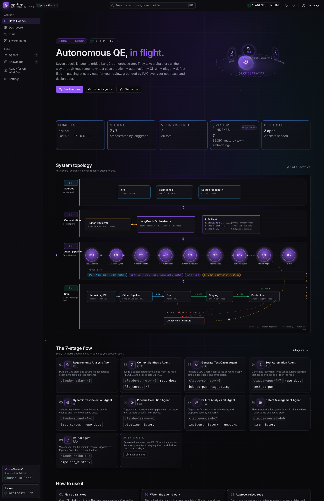
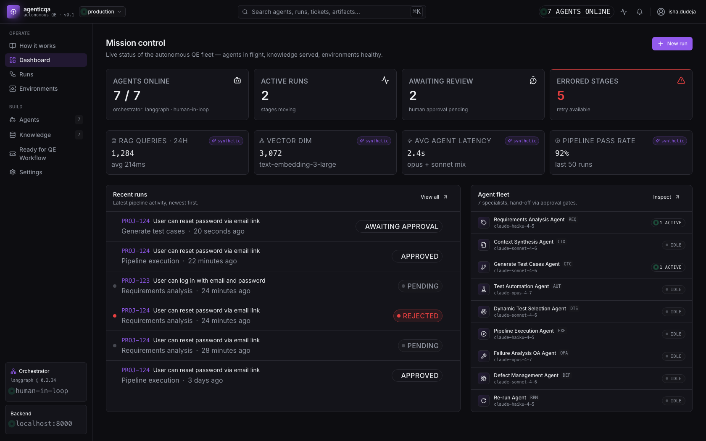
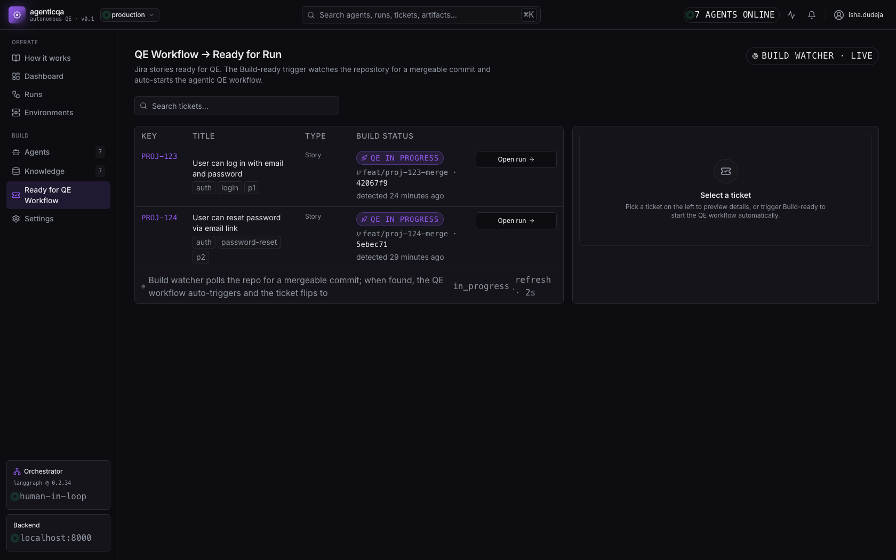
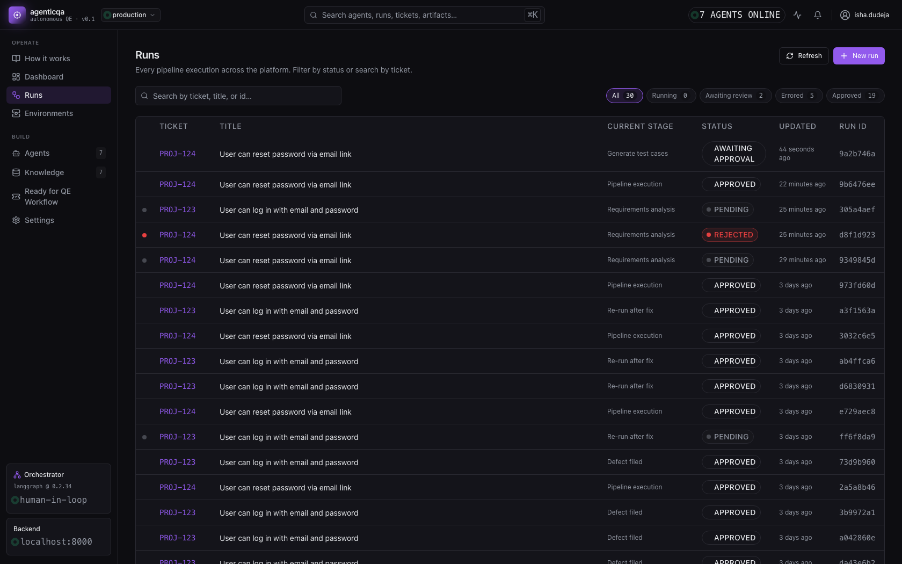
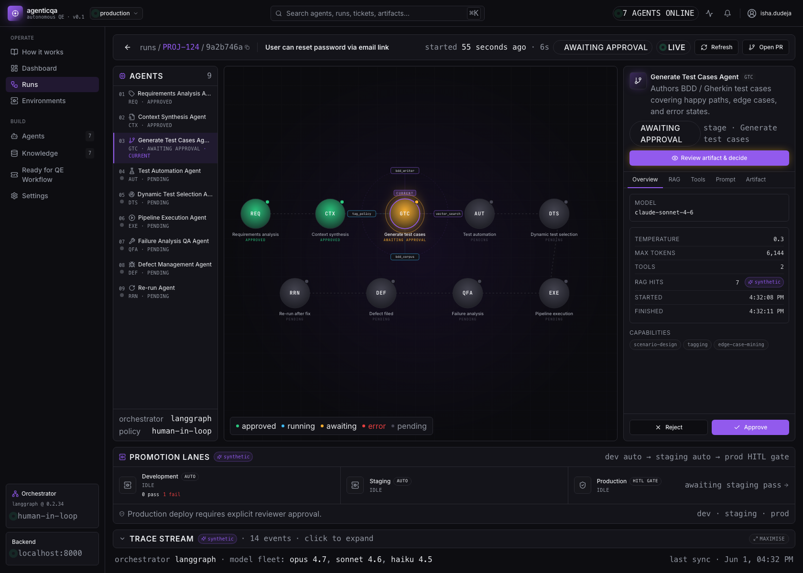
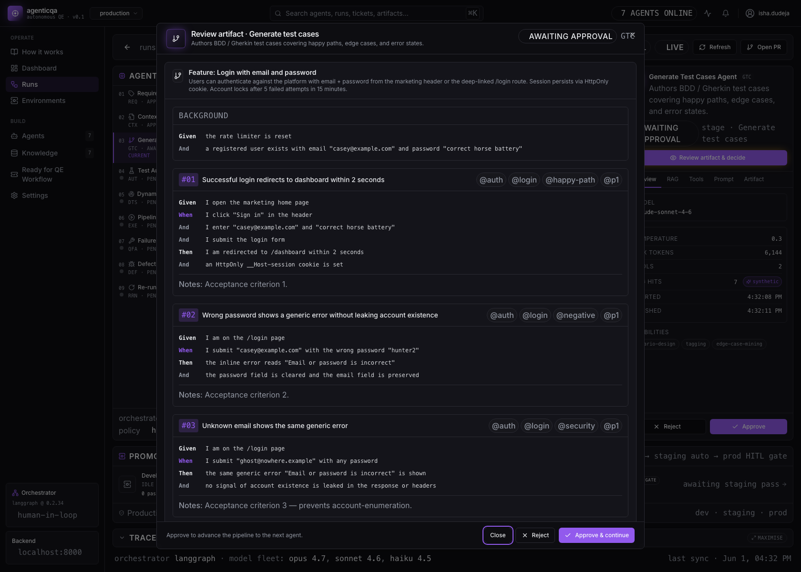
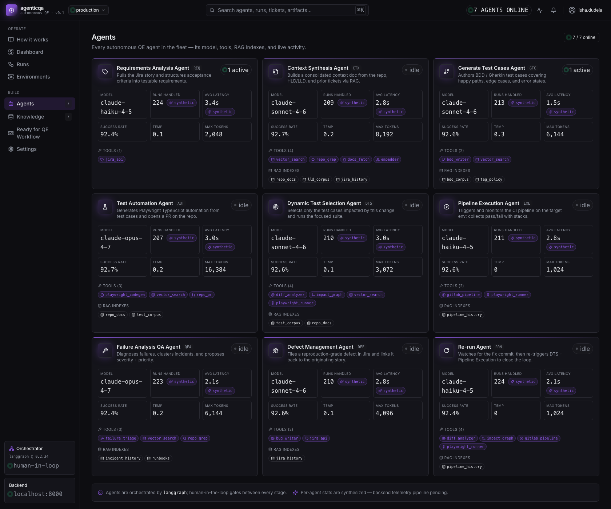
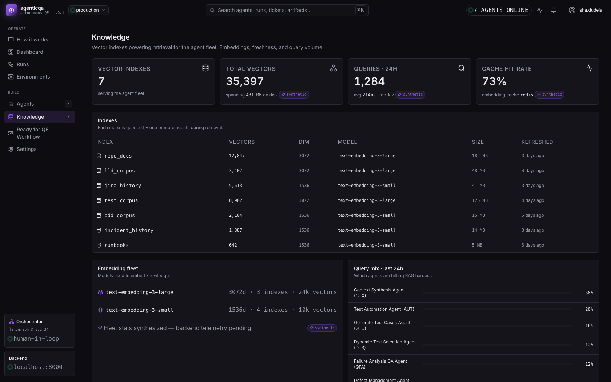
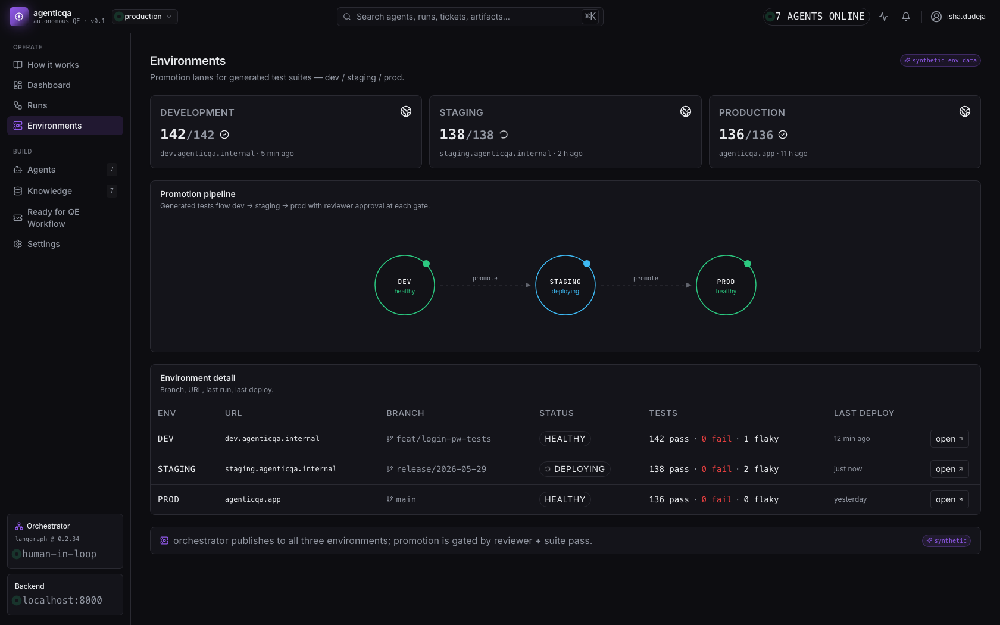

# agenticqa — Demo walkthrough

A visual tour of the autonomous QE platform. Every screenshot below is from a
live run of the system in `AGENTICQA_MOCK_MODE=true`, so no Anthropic API key is
required to reproduce it locally.

> [!NOTE]
> **Video coming soon.** A recorded walkthrough will be embedded at the top of
> this page once captured. To add one, drag the `.mp4` / `.mov` into a fresh
> GitHub issue comment, copy the resulting `https://user-images.githubusercontent.com/...`
> URL, and paste it into the `<!-- VIDEO -->` block below.

<!-- VIDEO

Paste the GitHub-hosted asset URL between the angle brackets — it auto-renders:

https://github.com/ishad01/agenticqa/assets/<id>.mp4

-->

---

## 1 · How it works — system topology

Landing page for newcomers. Hero with a 3D agent constellation orbiting the
LangGraph orchestrator core, live system-status cards, and a four-band
architecture diagram covering Sources → Orchestration → Agent pipeline →
Ship, plus a per-agent gallery and a numbered “how to use it” walkthrough.



The failure-loop curve in band 04 routes through the right margin so it never
crosses an env or pipeline box; the data-packet animations flow left-to-right
along the agent chain.

---

## 2 · Mission Control dashboard

Live KPIs over real backend state — agents online, active runs, awaiting your
review, errored stages — and a synthetic strip of RAG / latency / pass-rate
stats. The right rail shows the 7-agent fleet with per-agent live activity.



---

## 3 · Ready for QE Workflow — Build-ready trigger

The QE workflow is **triggered automatically when a mergeable commit lands**.
Click `Check repo for build · PROJ-XXX` on a row and the build-watcher
simulates polling the repository:

```
idle → checking (2.5s) → build_ready (commit + branch) → in_progress (run auto-created)
```

While in progress the action button flips to `Open run →`. The table
auto-polls every 2 s so all state changes appear live.



---

## 4 · Runs list

Every pipeline execution across the platform. Dense table, status pills,
filter chips with live counts, search across ticket / title / id, live
auto-refresh.



---

## 5 · Run detail — Agent IDE

LangGraph-Studio-style 3-pane: **agent palette** (left), **flow canvas**
(center) with pulsing halos on active nodes and the radiating knowledge
cluster around the selected agent, and **inspector** (right) with tabs for
Overview · RAG · Tools · Prompt · Artifact.

Below it: **Promotion lanes** (Dev/Staging auto, Production HITL-gated) and a
collapsed **Trace stream** that maximises on click.



The pipeline (current 9 agents): Requirements Analysis → Context Synthesis →
Generate Test Cases → Test Automation → Dynamic Test Selection → Pipeline
Execution → Failure Analysis QA → Defect Management → Re-run.

Human gates remain on **Requirements / Test Case Creation / Failure
Analysis** only. The rest auto-flow with a 3 s “running” window so the UI
visibly progresses.

---

## 6 · Artifact review modal

Every stage’s artifact is reviewable in a wide modal — click the highlighted
`Review artifact & decide` (or `View artifact`) in the inspector. The modal
renders the artifact in a human-readable view per stage type — Gherkin for
test cases, syntax-styled TypeScript for Playwright, severity card for
triage, etc. — with sticky Approve · Reject (with feedback) · Retry buttons.



---

## 7 · Agents — fleet inventory

Per-agent card showing model, tools, RAG indexes, capabilities, success
rate, average latency. Live activity badge when the agent is currently
handling a run.



---

## 8 · Knowledge — vector indexes

Seven RAG indexes feeding the fleet — `repo_docs`, `lld_corpus`,
`jira_history`, `test_corpus`, `bdd_corpus`, `incident_history`, `runbooks`
— with vector counts, dimensions, embedding model, and which agents are
hitting them.



---

## 9 · Environments — promotion lanes

Dev / Staging / Prod health, branches, pass/fail/flaky counts, last deploy
times, and an SVG promotion pipeline.



---

## End-to-end flow at a glance

| Stage | Owner | Auto-advance? | Output |
|---|---|---|---|
| Requirements Analysis | HITL | — | Structured Jira ticket |
| Context Synthesis | auto | ✓ | Consolidated markdown context (RAG over repo + docs) |
| Generate Test Cases | **HITL** | — | Gherkin feature + scenarios |
| Test Automation | auto | ✓ | Playwright `.spec.ts` files + PR |
| Dynamic Test Selection | auto | ✓ | Impacted-test subset via impact graph |
| Pipeline Execution | auto | ✓ | GitLab pipeline result |
| Failure Analysis QA | **HITL** | — (only on failure) | Severity, root cause, repro steps |
| Defect Management | auto | ✓ (only on failure) | Filed Jira bug |
| Re-run | auto | ✓ (only on failure) | Loop closure after fix — re-runs DTS + execution |

Promotion lanes auto-promote `dev → staging` on a green suite (whether from
the first execution or from the Re-run loop). Production deploy is the only
HITL gate beyond the agent pipeline.
